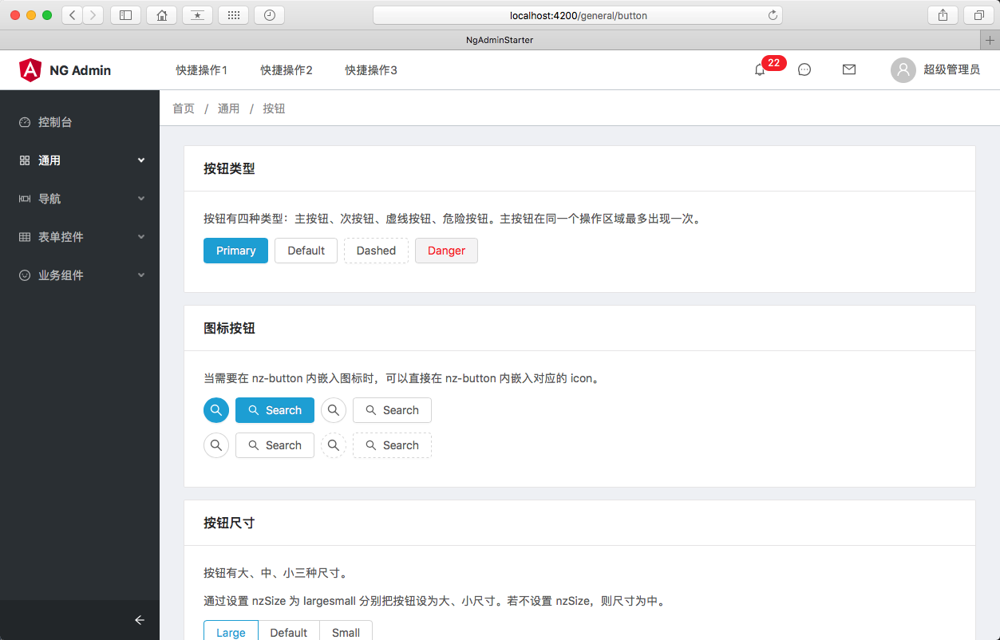
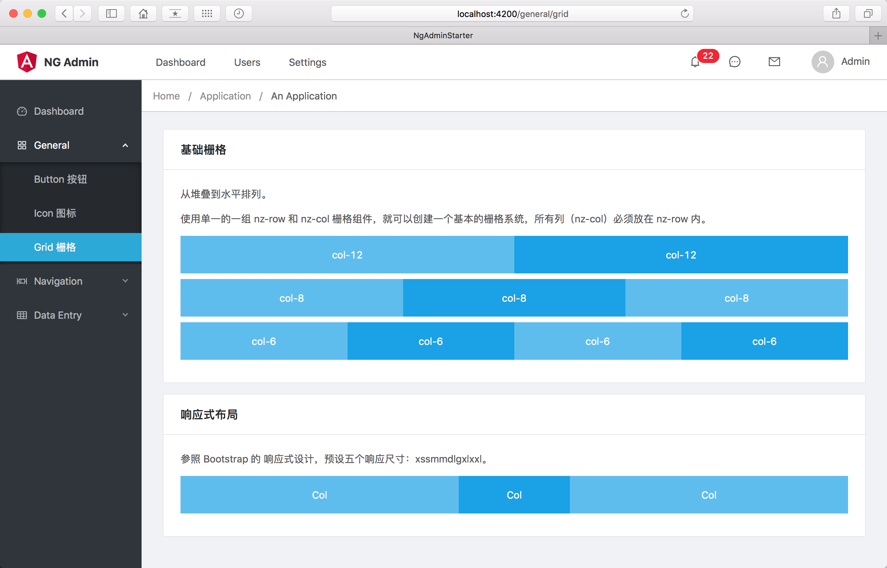
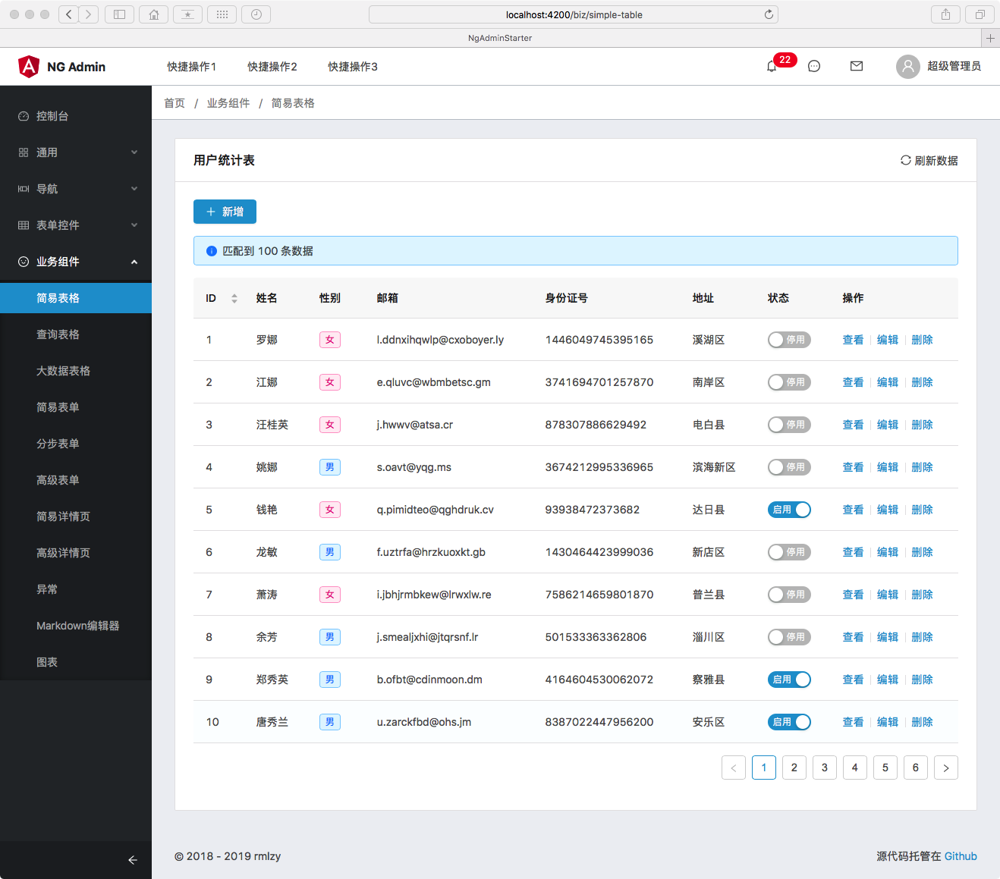

# NgAdminStarter

一个基于 [Angular 7.2.0](https://github.com/angular/angular) 和 [ng-zorro](https://github.com/NG-ZORRO/ng-zorro-antd) 的中后台系统模板。

## 预览







## 如何使用

```bash
git clone git@github.com:rmlzy/ng-admin-starter.git
cd ng-admin-starter
yarn install
yarn run start
```

执行 `ng serve` 之后，打开浏览器输入 `http://localhost:4200/`。

## 打包和部署

使用 `ng build` 来打包项目，默认启用了 `--aot` 和 `--prod`。

## 单元测试

使用 `ng test` 启用单元测试。

## 自动化测试

使用 `ng e2e` 启用自动化测试。
